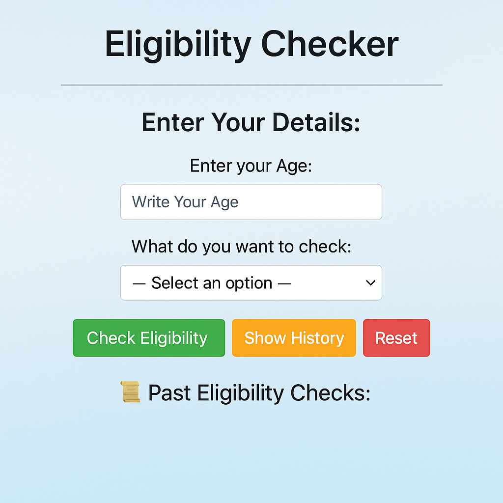

# 🧮 Eligibility Checker

A simple, interactive web app that checks your eligibility for key life milestones — like driving, voting, drinking, marriage, and retirement — based on your age. Built with just **HTML**, **CSS**, and **JavaScript** (no external frameworks).

## 🚀 Live Demo

🔗 [Click here to view the project on GitHub Pages](https://your-username.github.io/eligibility-checker)

> *(Replace the above link with your actual GitHub Pages URL after deployment)*

---

## 🖼️ Preview

---

## 🛠️ Technologies Used

- **HTML5** – for the page structure
- **CSS3** *(internal)* – for styling and layout
- **JavaScript** *(internal)* – for interactivity, logic, and history tracking

---

## ✨ Features

- ✅ Check eligibility for:
  - Driving (16+)
  - Voting (18+)
  - Drinking (21+)
  - Marriage (25+)
  - Retirement (60+)
- 📜 Keeps a record of all previous checks in the same session
- 🔄 Includes a **Reset** button to clear inputs and history
- 🎨 Stylish layout with background image and colored buttons
- 💡 Responsive and easy to use

---

## 📂 Project Structure

📁 eligibility-checker/
├── index.html # Single HTML file with embedded CSS & JS
├── 7459333.jpg # Background image used in the UI
└── README.md # This file
